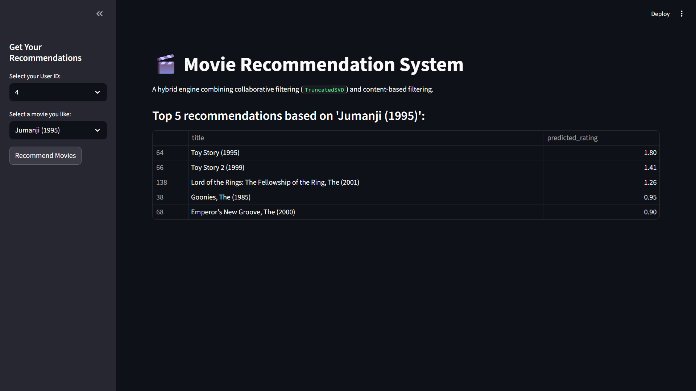

# 🎬 Hybrid Movie Recommendation System

This project is a hybrid movie recommendation system built in Python. It provides personalized movie suggestions by combining two different machine learning techniques: **Content-Based Filtering** and **Collaborative Filtering**.

An interactive web application is included, built with **Streamlit**, to demonstrate the model's recommendations in real-time.

---

## 🚀 Demo




---

## ✨ Features

* **Hybrid Approach:** Combines content-based filtering (using movie genres) and collaborative filtering (using user ratings) for robust and accurate recommendations.
* **Personalized Re-Ranking:** Generates a list of similar movies (candidates) and then re-ranks them based on the specific user's predicted preference score.
* **Interactive UI:** A simple and clean web interface built with Streamlit to select a user, choose a movie, and receive live recommendations.
* **Data-Driven:** Built using the popular **MovieLens dataset** and data manipulation techniques with **Pandas**.

---

## 🛠️ How It Works

The recommendation logic follows a two-step hybrid process:

1.  **Candidate Generation (Content-Based):**
    * Movies are first filtered based on genre similarity to a user's selected movie.
    * This is achieved using **TF-IDF Vectorization** on the movie genres, followed by **Cosine Similarity** to find the top `N` most similar movies.

2.  **Personalization & Re-Ranking (Collaborative Filtering):**
    * A **TruncatedSVD** (Singular Value Decomposition) model is trained on the full user-item ratings matrix to understand latent user preferences and movie features.
    * This model generates a predicted rating for the specific user for all movies in the candidate list.
    * The candidate movies are then sorted by this predicted score, and the top 5 are presented to the user.

This approach ensures that recommendations are not just *similar* to the input movie but are also *personally tailored* to the user's unique taste.

---

## ⚙️ Getting Started

### Prerequisites

* Python 3.9+
* Conda or a Python virtual environment

### Installation

1.  **Clone the repository:**
    ```bash
    git clone https://github.com/akulgarg7/Hybrid_Movie_Recommender.git
    cd Hybrid_Movie_Recommender
    ```

2.  **Create and activate a virtual environment**

3.  **Install the required libraries:**
    ```bash
    pip install pandas scikit-learn streamlit textblob
    ```

4.  **Download the data:**
    * Download the **'ml-latest-small'** dataset from the [MovieLens website](https://grouplens.org/datasets/movielens/latest/).
    * Unzip and place the `ml-latest-small` folder in the root of this project directory.

---

## ▶️ Usage

### 1. Jupyter Notebook (Development)

The file `development.ipynb` contains all the steps for data cleaning, model development, and experimentation. You can run this in a Jupyter environment to see the step-by-step process.

### 2. Streamlit App (Deployment)

To run the interactive web application:

1.  Make sure you are in the project's root directory in your terminal.
2.  Run the following command:
    ```bash
    streamlit run app.py
    ```
3.  Your default web browser will automatically open to the app's local URL.

---

## 📂 Project Structure
```.
├── app.py                   # The Streamlit web application
├── development.ipynb  # Jupyter Notebook for development and experimentation
├── ml-latest-small/         # MovieLens dataset folder (must be downloaded)
│   ├── movies.csv
│   ├── ratings.csv
│   └── ...
└── README.md                # This README file
```
---

## 💻 Key Technologies

* **Python**
* **Pandas:** For data manipulation and creating the user-item matrix.
* **Scikit-learn:** For `TfidfVectorizer`, `cosine_similarity`, and `TruncatedSVD`.
* **Streamlit:** For building and serving the interactive web UI.
* **Jupyter Notebook:** For experimentation and development.

---

## 🙏 Acknowledgments

* Project created as part of the **Elevate Labs** virtual internship.
* Data provided by [Grouplens](https://grouplens.org/datasets/movielens/) (MovieLens dataset).
